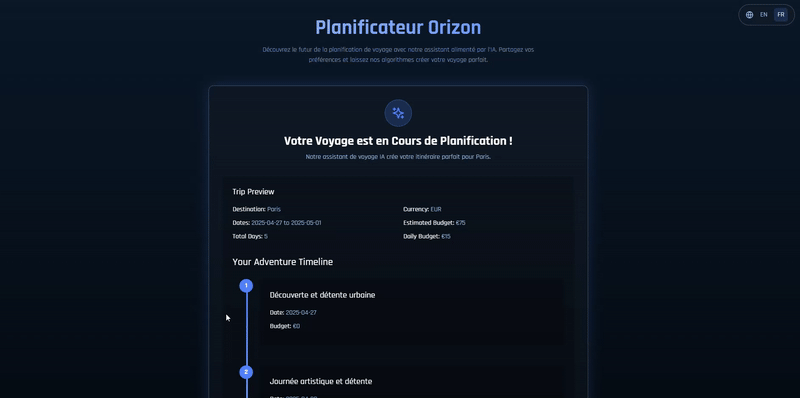
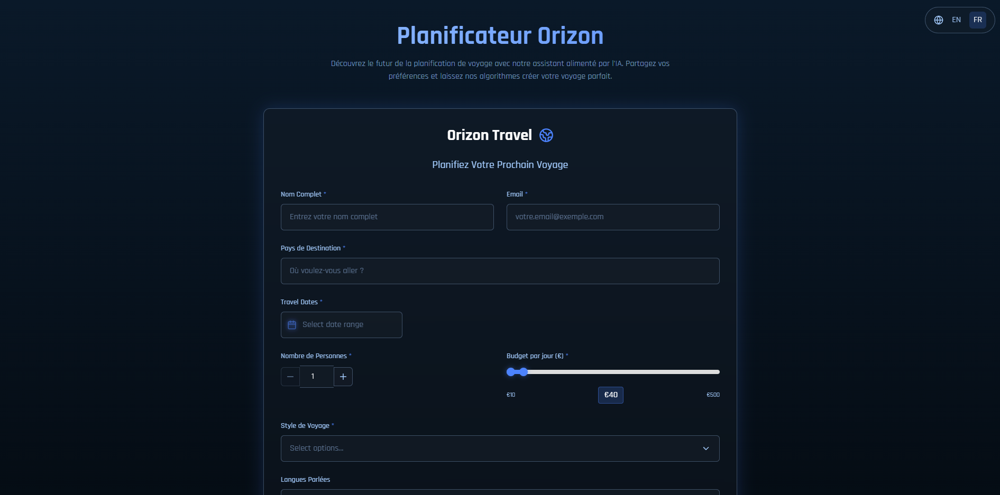

# Orizon - Intelligent Travel Planning

Orizon est une application web moderne de planification de voyage qui utilise l'IA pour créer des itinéraires personnalisés. L'application offre une expérience utilisateur immersive avec une interface gamifiée et des animations fluides.



## ✨ Fonctionnalités

- 🎯 **Planification intelligente** : Créez des itinéraires de voyage personnalisés basés sur vos préférences
- 🎮 **Interface gamifiée** : Visualisez votre voyage comme un parcours de jeu avec une timeline interactive
- 🌐 **Support multilingue** : Disponible en plusieurs langues
- 💰 **Gestion du budget** : Estimation précise des coûts pour chaque activité
- 📱 **Design responsive** : Fonctionne parfaitement sur tous les appareils
- 🎨 **Interface moderne** : Design épuré avec animations fluides et effets visuels

## 🛠️ Technologies utilisées

- **Frontend** :
  - React 18
  - TypeScript
  - Tailwind CSS
  - Framer Motion (animations)
  - Lucide React (icônes)

- **Outils de développement** :
  - Vite
  - ESLint
  - Prettier
  - PostCSS

## 🚀 Installation

1. Clonez le dépôt :
```bash
git clone https://github.com/mardev60/orizon.git
cd orizon
```

2. Installez les dépendances :
```bash
npm install
```

3. Lancez l'application en mode développement :
```bash
npm run dev
```

4. Pour la production :
```bash
npm run build
npm run preview
```

## 📁 Structure du projet

```
src/
├── components/         # Composants React
│   ├── TravelForm.tsx  # Formulaire principal
│   ├── TravelTimeline.tsx # Timeline interactive
│   └── ...            # Autres composants
├── services/          # Services API
├── types/            # Définitions TypeScript
├── utils/            # Fonctions utilitaires
└── styles/           # Styles globaux
```

## 🎨 Design System

L'application utilise un système de couleurs cohérent :

- `dark-blue` : Fond principal
- `ice-blue` : Texte secondaire
- `neon-blue` : Accents et éléments interactifs
- `black` : Fond des cartes et éléments

## 🤝 Contribution

Les contributions sont les bienvenues ! Voici comment contribuer :

1. Fork le projet
2. Créez une branche pour votre fonctionnalité (`git checkout -b feature/AmazingFeature`)
3. Committez vos changements (`git commit -m 'Add some AmazingFeature'`)
4. Push vers la branche (`git push origin feature/AmazingFeature`)
5. Ouvrez une Pull Request

## 📝 Licence

Ce projet est sous licence MIT. Voir le fichier `LICENSE` pour plus de détails.

## Screenshots


## 🙏 Remerciements

- [Lucide Icons](https://lucide.dev/) pour les icônes
- [Framer Motion](https://www.framer.com/motion/) pour les animations
- [Tailwind CSS](https://tailwindcss.com/) pour le styling

---

Développé avec ❤️ par Marouan 